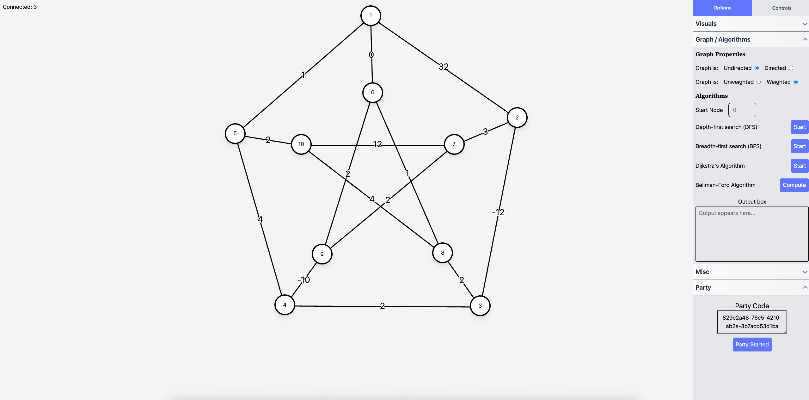
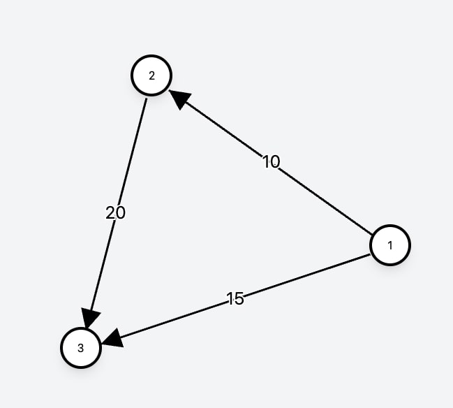

# Graphical: A Collaborative Node CS-Graph Editor.
### Check out a demo of the web app [here](https://graphicalfrontend-production.up.railway.app/).
**Please note that there may be some latency between users while in a party based on your location.**



## Overview of Build:
* Frontend: Vite + React TS
* Websocket Handling: Socket-io
* Backend Cache Storage: Ioredis
* Basic Input Validation: Zod

## Features:
Below is a quick summary of Graphical's supported features.
### Graph States:
* Undirected Graphs
* Directed Graphs
* Weighted Graphs
### Algorithms:
* Depth-First Search (DFS) + Animation
* Breadth-First Search (BFS) + Animation
* Dijkstra's Algorithm + Animation
* Bellman-Ford Algorithm

Each algorithm outputs its path or result in the box marked **Output Box**.

### Input Graphs:
You may copy-and-paste graph information into the box marked **Input Box**.

Pasted graph information **must** be in the form:

```
Total # of Nodes <space> Total # of Edges
Edge 1 Weight 1
Edge 2 Weight 2
Edge 3 Weight 3
...
Edge N Weight M
```
where an **Edge** with Weight **M** is in the form:

**Start Node (space)  End Node (space) M**

*Note: If weights aren't provided, they will be filled in as 0*
___

For example a graph with three nodes that looks like:



can be inputed as following:
```
3 3
1 2 10
1 3 15
2 3 20
```


### Parties and Collaboration:
You can start a party by clicking on the **Start Party** button in the party tab.

To join a party, click **Join Party** on the Main Menu and enter the party code.

Within a party, all graph changes are synced between users. However, visual options remain independent.

### Keybind Customization and Controls:
Currently there are two keybinds that may be customized from the **Controls** tab: **Create Node** and **Component Deletion**. 

Click the button on each tab and press any key to change them.
